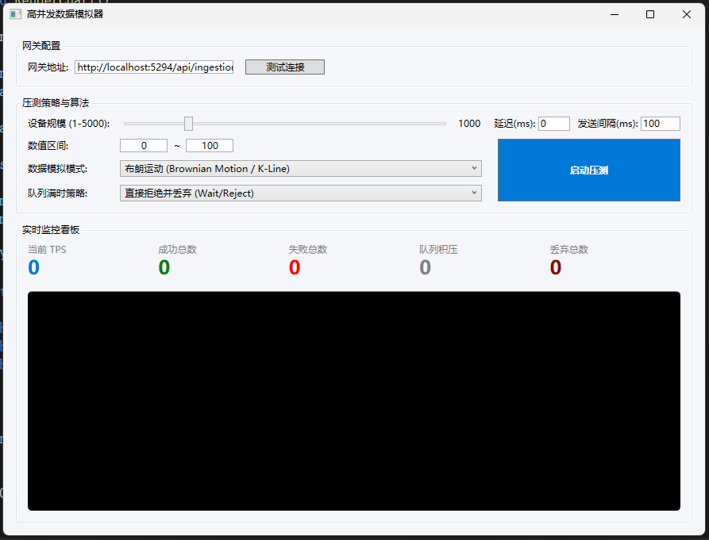

# WPF 高并发数据模拟器

一个基于 WPF (.NET) 的高性能传感器数据模拟压测工具，支持大规模设备模拟、多种数据生成算法、灵活背压策略，以及实时监控看板。

------

## 📸 界面预览

  

------

## ✨ 功能特性

- **大规模并发模拟**
  支持 1 ~ 5000 个虚拟设备同时生成数据并上报。
- **灵活的压测策略配置**
  - 自定义目标网关地址
  - 可调节发送间隔与延迟
  - 数值范围自定义（最小值 ~ 最大值）
- **三种数据生成模式**
  - `纯随机模式`：在设定区间内完全随机生成
  - `布朗运动（K线模拟）`：模拟连续波动，边界反弹
  - `波峰异构正弦波`：动态振幅与相位的正弦波，贴近真实传感器行为
- **智能背压处理**
  当内部消息队列积压时，提供三种处理策略：
  - `直接拒绝并丢弃`：等待队列空闲（可能阻塞生产者）
  - `丢弃队列最旧数据`：为新数据腾出空间
  - `丢弃当前最新数据`：保留历史数据
- **实时监控看板**
  - 当前 TPS（每秒成功请求数）
  - 累计成功/失败请求数
  - 队列积压数量及告警阈值（≥80% 容量时变红）
  - 丢弃数据总量
  - 动态波形图（展示设备 #1 的数据趋势）
- **高并发 HTTP 引擎**
  - 基于 `SocketsHttpHandler` 优化的连接池（最大 20000 连接）
  - 可配置并发发送线程数（自动根据设备规模扩展）
  - 支持 HTTP/2 多路复用

------

## ⚙️ 配置说明

| 配置项       | 说明                                                         |
| :----------- | :----------------------------------------------------------- |
| 网关地址     | 目标数据接收端点 URL（示例：`http://localhost:5294/api/ingestion/upload`） |
| 设备规模     | 滑动条选择 1 ~ 5000 台虚拟设备                               |
| 延迟(ms)     | 每条消息发送前的固定延迟                                     |
| 发送间隔(ms) | 每轮数据生成的间隔时间                                       |
| 数值区间     | 生成数据的取值范围                                           |
| 数据模拟模式 | 随机 / 布朗运动 / 正弦波                                     |
| 队列满时策略 | Wait / DropOldest / DropWrite                                |

------

## 🔧 技术实现要点

### 高并发架构

- **生产者-消费者模式**
  使用 `System.Threading.Channels` 构建有界通道，解耦数据生成与 HTTP 发送。
- **并行数据生成**
  `Parallel.For` 并行迭代所有设备，每个设备独立维护状态（`DeviceState`），避免锁竞争。
- **异步批量发送**
  `Parallel.ForEachAsync` 配合 `Channel.Reader.ReadAllAsync` 实现多线程并发消费。

### 图表渲染

- 基于 WPF `Canvas` 与 `Polyline` 动态绘制实时趋势线。
- 每 1 秒由 `DispatcherTimer` 触发 UI 刷新与统计更新。

### 状态管理

- 使用 `Interlocked` 原子操作更新计数器（成功/失败/TPS/丢弃），确保高并发下的统计准确性。

------

## 📌 关联项目

本工具为整体解决方案的一部分，需配合以下仓库使用：

- **[高并发服务器]**
  基于 [ASP.NET](https://asp.net/) Core 的高性能数据接收与处理服务
- **[WPF 上位机监控平台]**
  实时展示设备状态与历史数据的可视化监控终端
- 
  

------

## 📝 注意事项

- 压测时请确保目标服务器具备足够的处理能力，避免因请求过载导致服务不可用。
- 若选择 `直接拒绝并丢弃` 策略，当队列满时生产者线程会阻塞等待，可能影响生成频率。
- 图表仅展示设备 ID 为 `1` 的数据趋势，用于快速观察算法行为。

------

## 📄 许可证

[MIT License](https://license/)